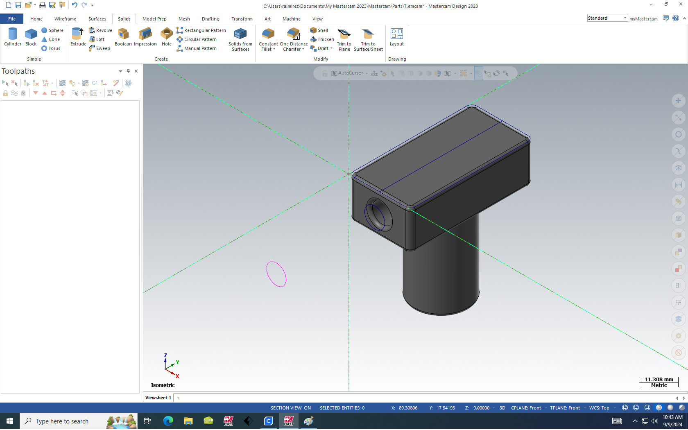
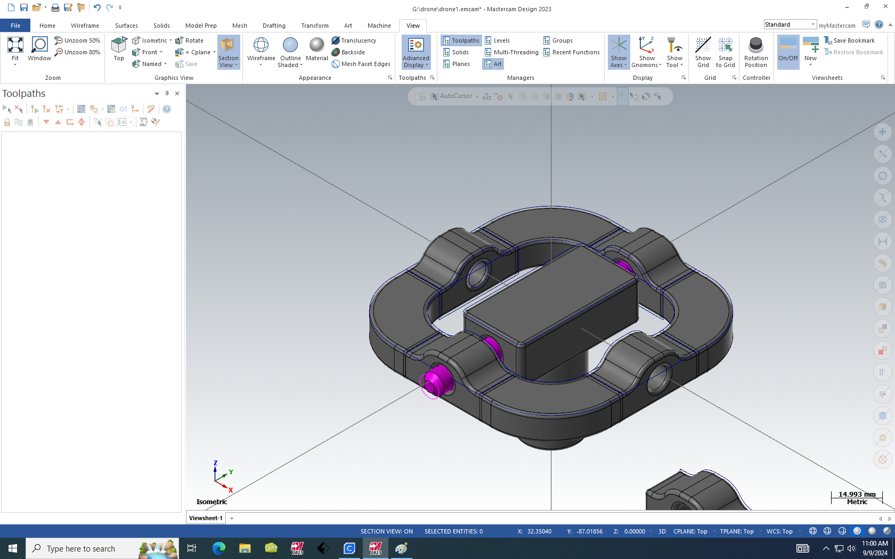
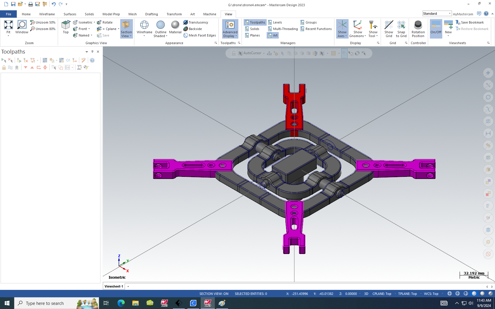
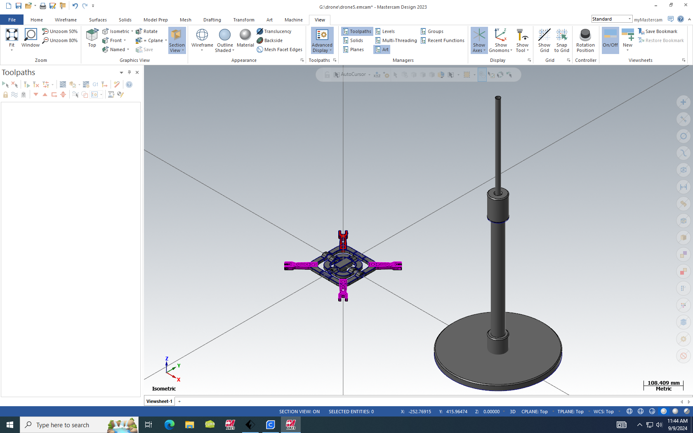
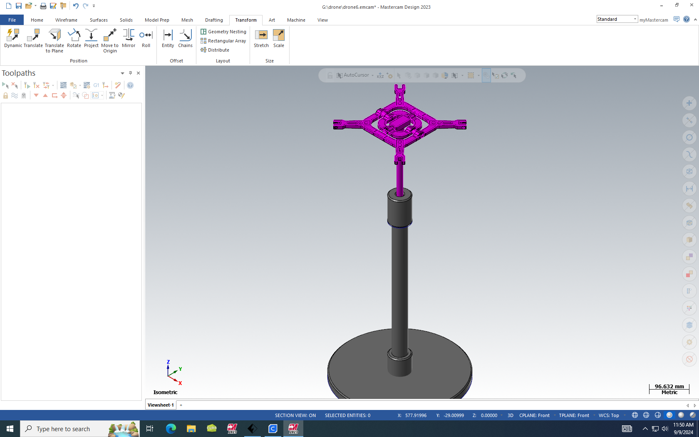
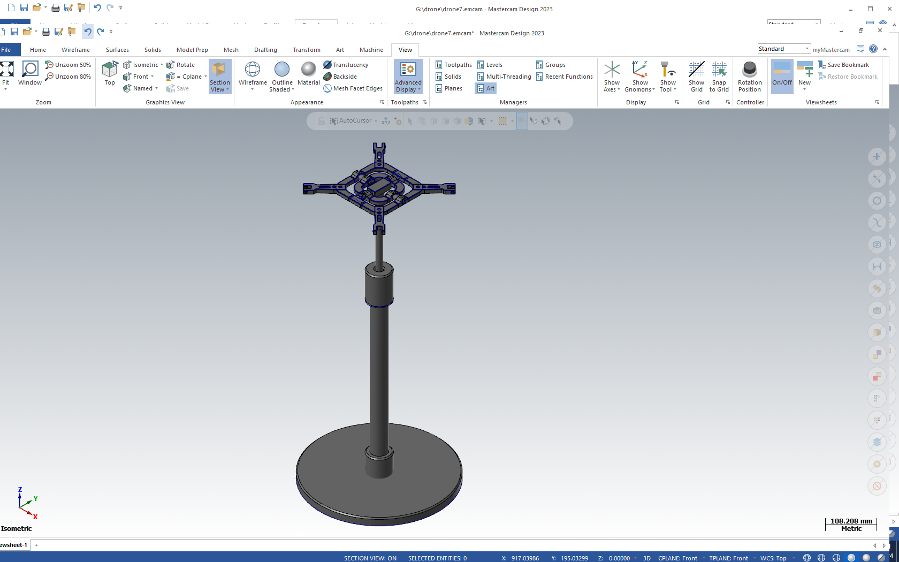
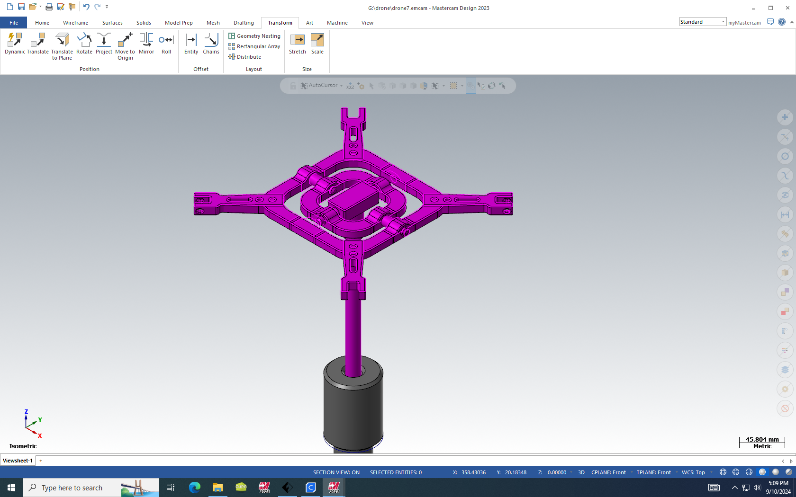

# UAV 4DOF Test Stand | 3D Print and Mastercam

UAV test stand for 4DOF roll, pitch, yaw, and altitude experiments. This repository contains the CAD, CAM, and figure assets for the printed stand used in the experimental platform.

This hardware supports the work documented in the related repository:

[navio2-quadcopter-autopilot-stack](https://github.com/IshaqHMK/navio2-quadcopter-autopilot-stack)

## Contents

- `figures/` renderings and build photos
- `mastercam/` Mastercam project files (`.emcam`, `.gx`)
**Contents**
- `figures/` renders and build photos
- `mastercam/` Mastercam project files (`.emcam`, `.gx`)

**Figures**

**CAD/CAM Files**
- Mastercam source files are in `mastercam/` (e.g., `drone1.emcam`, `drone1.gx`, `dronearm.gx`).

**Academic Use, Data, Collaboration**
- This repository is for academic use.
- For collaborations and updated versions, contact: `ishaq.hmk@gmail.com`
